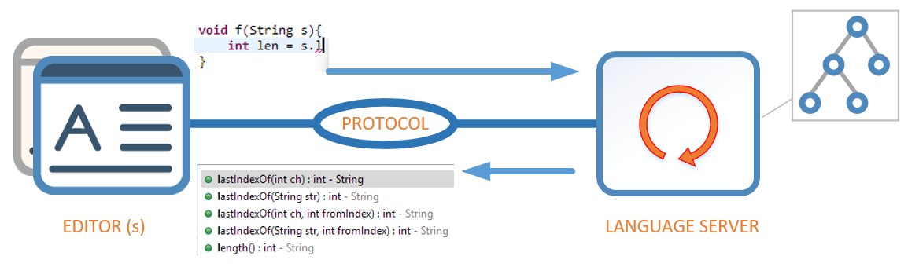

Eclipse and Language Server based Editors
=========================================

Patrik Suzzi <psuzzi@gmail.com>
v 0.1, June 2016

== Language Server Protocol (LSP) == 

The idea is to have Editors as clients, communicating with a Language Server using a defined protocol, where:

* The _client sends_ partial information (edit deltas) to the Language Server; 
* The _server parses and computes_ the AST,  
* The _server responds_ to the editor with code completion proposals, compilation errors, etc.

=== Concrete Implementations ===

This approach separates editing from language processing. It is born to support web editors (thin clients), and now there are also desktop editors (thick clients) based on it. As an example: _Visual Studio Code_, _Eclipse Che_, _Xtext_, _Typefox_, and other products and enterprises are implementing/using this approach.

=== Current Market ===

* *_VSCode_* is the reference implementation, and it is known to be an excellent product for web-based languages editing. Protocol and server are open-source, _MIT-licensed_, and written in JavaScript. It provides multi-platform, desktop clients for Win, Linux, and Mac.
* *_Eclipse Che_* is a web-based editor, part of the Eclipse ecosystem, For what I understand it is using the same approach; so there should be an implementation of Language Server - although it is not clear to me whether it implements the same protocol -
* *_Xtext_* is providing Language Server support to Eclipse Che, and the Typefox team has already implemented a Java interface to define the protocol. However, it is understood that implementing a Java Thick Client is out of their scope. 

=== Need for a Proof of Concept in Eclipse ===

The competition also landed on multi-platform editors; the opportunity to increase the value of the community and the possible growth of a market for Language Servers, are some of the reasons that pushed us, at the Eclipse unconference, to analyze the approach and problem, and decided to start with a PoC.

= PoC: Eclipse Editor using Lang server  =

A simple proof of concept: build an Eclipse Editor that communicate to a LanguageServer using the  https://github.com/Microsoft/vscode-languageserver-protocol[vscode-languageserver-protocol].

The easiest way to test, is to extend the JSDT editor, and use a protocol implementation, to reuse the existing vscode language server. Below are some interesting references:

* Extend the JSDT JavaScript editor. As example, we can read this article:  http://codeandme.blogspot.fr/2014/05/extending-jsdt-adding-your-own-content.html[Extending JSDT editor]
* Re-use a Java implementation of the protocol, that is VS Code independent can be found here: https://github.com/TypeFox/ls-api[TypeFox/ls-api] 
 

Sven Efftinge (sven@efftinge.de) sven@efftinge.de via eclipse.org 
10 Jun 2016, 10:08 PM 

to Discussions 
A Java implementation of the protocol, that is VS Code independent can be found here: https://github.com/TypeFox/ls-api
It defines all the structures in Java interfaces and beans and takes care of the (de)serialization to/from json.
It is currently used by Che, Xtext, and the a JavaC based java language server.

== Typefox/ls-api ==

The Typefox guys are currently working on an implementation of the protocol to connect Eclipse Che to Xtext language server. They are not interested in Eclipse Client development, and there are some limitations in the typefox ls-api: 

* The repo uses xtend api, and you need to use gradle to build it. 
* Seems the ls-api is using system.out/in, instead of named pipes or sockets to connect 

=== Details on ls-api ===

The interface `Language Server`,(in `io.typefox.lsapi.services`) is for the impl of https://github.com/Microsoft/vscode-languageserver-protocol

The class `JsonBasedLanguageServer` is a sample impl of a server

=== Client ===

Client is an editor that implements the basic methods. See `TextDocumentService`. 

